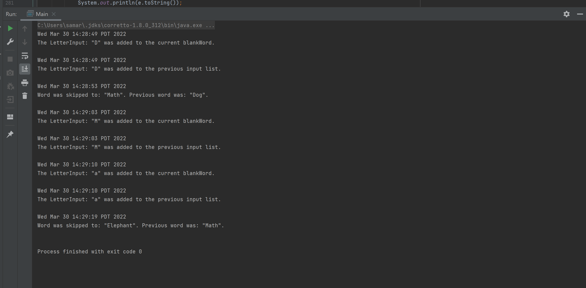

# Hang-Man Project
by Samarjit Bhogal

-----
This application is a simple game of Hang-Man, a word guessing game. The user will have to guess the word 
provided in front of them where each letter are in blank spaces. If they guess a letter right for the word, 
then the letter(s) will be placed in the blank(s). However, if they guess wrong a stick figure will form starting with
its head, hanging off a pole. If it gets to a full stick man, it is game over for the user, and they can restart 
with another word. Every word guessed correctly adds 100 points to the score! However, if hangman is fully formed, 
100 points will be lost! Any word can be skipped at anytime, but 50 points will be lost!

Anyone who enjoys a nice simple but yet challenging game will have fun
with this application. I have always
been quite fond of playing games, and I always wanted to make a
game. In the future I want to become a video game developer and this
project will be good experience in that direction hence why I choose to
re-create Hang-Man. 

Get the highest score you can! I hope you enjoy!

User Stories:

- As a user, I want to be able to add letters to the current hang-man word
- As a user, I want to be able to see my word building as I add letters
- As a user, I want to be able to see the hang-man when it gets more parts
- As a user, I want to be able to see my score
- As a user, I want to be notified with how many guesses I have.
- As a user, I want to be able to skip a word.
- as a user, I want to be able to see all the letters I have already tired.
- As a user, I want to save my game progress.
- As a user, I want to load my game progress from where I last saved.
---
### Phase 4: Task 2

### Phase 4: Task 3

Looking back on my UML class diagram, there is definitely some 
refactoring I could have done. 
    
- Having letterInput of as field for HangManAppGUI can be simplified if GuessWord handles
what ever HangManAppGUI need LetterInput for
- Score, HangMan, and GuessWord can all be used in a new model class called Game.
this class can have all the functionality of a basic hangman game. Game would be the 
only class implementing Writable and the only model class HangManAppGUI needs an association with.
- Since HangManApp was the first UI class for the console based application, these changes stated should also
apply in regard to it.
- The HangManAppGUI is a pretty sophisticated and extensive class, so it would be beneficial to segregate some
specific functionality from HangManAppGUI to some new classes where it can be more obvious to how the GUI is structured.